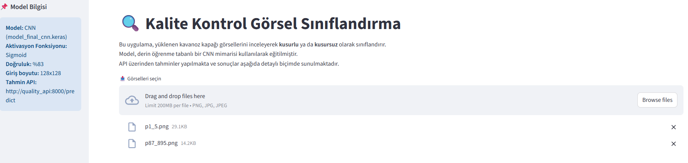
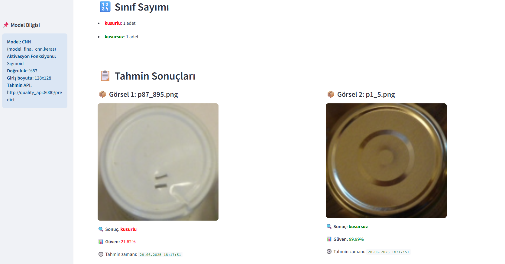

#  Kavanoz Kapağı Kalite Kontrol Sistemi

Bu proje, kavanoz kapağı görsellerini analiz ederek **kusurlu** ya da **kusursuz** olup olmadığını otomatik şekilde sınıflandıran bir kalite kontrol sistemidir.  
Streamlit tabanlı görsel arayüzü sayesinde kullanıcı dostu bir deneyim sunar ve model tahminleri bir RESTful API üzerinden alınır.


## 📁 Proje Yapısı

```plaintext
QUALITY_CONTROL_PROJECT/
├── api/                         # FastAPI backend uygulaması
│   ├── app.py                  # API ana uygulama dosyası
│   ├── model_loader.py         # Modeli yükleyip tahmin yapan yardımcı modül
│   └── test_predict_single.py  # Tek görsel için test scripti
│
├── data/                        # Eğitim ve model verileri
│   ├── annotations/            # Görsellerin etiket bilgileri
│   │   └── jarlids_annots.csv
│   ├── dataset/                # Ham veri (etiketsiz)
│   │   ├── kusurlu/
│   │   └── kusursuz/
│   ├── preprocessed/           # Ön işlemden geçmiş görseller
│   │   ├── kusurlu/
│   │   └── kusursuz/
│   ├── raw/                    # Ham verinin orijinal hali
│   ├── split/                  # Eğitim/val/test ayrımı yapılmış veri seti
│   │   ├── test/
│   │   ├── train/
│   │   └── val/
│   └── model_final_cnn.keras   # Eğitilmiş CNN model dosyası
│
├── demo_images/                # Arayüzde test etmek için örnek görseller
│
├── docker/                     # Docker ile ilgili tüm yapılandırma dosyaları
│   ├── docker-compose.yml      # Tüm sistemi ayağa kaldıran Docker Compose dosyası
│   ├── Dockerfile.api          # API için Dockerfile
│   └── Dockerfile.frontend     # Streamlit arayüzü için Dockerfile
│
├── .docker/                    # Docker base image hatalarını (credential helper eksikliği) önlemek için yapılandırma dosyası
│   └── config.json            
│
├── frontend/                   # Streamlit frontend uygulaması
│   └── streamlit_app.py        # Ana Streamlit uygulaması
│
├── model/                      # Model eğitimi ve değerlendirme dosyaları
│   ├── evaluate_model.py
│   ├── evaluate_on_test.py
│   ├── test_input_shape.py
│   ├── train_keras.py
│   
│
├── preprocessing/              # Görsel işleme , veri kontrolü ve etiketleme scriptleri
│   ├── crop_and_label.py
│   ├── excelanaliz.py
│   ├── image_cleaner.py
│   ├── kontrol.py
│   ├── split_dataset.py
│   
│
├── screenshots/                # README için uygulama arayüz görselleri
│   ├── ss1.png
│   └── ss2.png
│
├── README.md                   # Proje dökümantasyonu
└── requirements.txt            # Python bağımlılık listesi
```


 
 ## 1- Kurulum

Projeyi çalıştırmak için aşağıdakilerin sisteminizde kurulu olması gerekir:

- [Docker](https://www.docker.com/)
- [Docker Compose](https://docs.docker.com/compose/)

---

## 2- Başlatma Adımları

Aşağıdaki komutları sırasıyla terminalde çalıştırarak projeyi ayağa kaldırabilirsiniz:

```bash
cd docker
docker-compose down -v           # Eski container ve volume'leri temizle
docker-compose build --no-cache  # Tüm container'ları sıfırdan inşa et
docker-compose up                # API ve Streamlit arayüzünü başlat

---

##  NOTLAR

- Docker build sırasında `python:3.10` veya benzeri base image'lar ile ilgili credential hataları (`"docker-credential-desktop" bulunamadı`) alıyorsanız, bu hata sisteminizde Docker ile ilişkili credential helper'ın eksik olmasından kaynaklanmaktadır.

- Bu hatayı almamak için önerilen çözümler:

  1. **Alternatif image kullanımı (tavsiye edilir):**  
     Dockerfile içinde `FROM python:3.10` yerine aşağıdakilerden biri kullanılabilir:  
     - `python:3.10-buster`  
     - `python:3.10-alpine`

  2. **Credential helper bileşenini sisteminize yüklemek:**  
     Docker Desktop > Settings > Resources > Experimental özelliklerinden kontrol edebilirsiniz.

- Ancak bu hatayı almanız çalışmayı engellemez; `docker-compose up` komutu ile container'lar başlatıldığında sistem çalışır durumda olacaktır. Uygulama:

  -  [http://localhost:8501](http://localhost:8501) — Streamlit arayüzü  
  -  [http://localhost:8000/docs](http://localhost:8000/docs) — FastAPI Swagger dokümantasyonu 
  
  ```


 ## 3- Model Bilgisi

- **Model Tipi:** Convolutional Neural Network (CNN)
- **Model Dosyası:** `model_final_cnn.keras`
- **Giriş Boyutu:** `128 x 128 x 1` (grayscale görseller)
- **Çıkış:** Tek nöronlu sigmoid aktivasyon (kusursuz/kusurlu)
- **Eğitim Verisi:** `data/split/` klasöründeki etiketlenmiş kavanoz kapağı görselleri
- **Başarım:** Doğruluk (accuracy) ≈ %83
- **Karar Eşiği:** Tahmin değeri > 0.5 → `kusursuz`, aksi takdirde `kusurlu`
- **Model Yükleme:** API tarafında otomatik olarak `model_loader.py` üzerinden yüklenmektedir.
- **Tahmin API'si:** FastAPI ile `/predict` endpoint'i üzerinden REST çağrıları yapılır.


## 4- Uygulama Arayüzü

Aşağıda, uygulamanın kullanıcı arayüzüne ait iki ekran görüntüsü sunulmuştur:

- İlk görselde uygulamanın giriş ekranı, dosya yükleme alanı ve sınıf sayımı gibi bilgiler yer alır.
- İkinci görselde ise modelin tahmin ettiği sonuçlar, güven skorları ve tahmin zamanları detaylı olarak gösterilmektedir.





---

## 5 Katkı Sağlama

Projeye katkıda bulunmak isterseniz aşağıdaki adımları takip edebilirsiniz:

1. Bu repoyu fork'layın.
2. Yeni bir branch oluşturun (`git checkout -b feature/yenilik`).
3. Gerekli değişiklikleri yapın ve commit edin (`git commit -m 'Yeni özellik eklendi'`).
4. Fork'tan bir pull request (PR) gönderin.

Her türlü geri bildiriminiz ve katkınız değerlidir. Teşekkürler!


